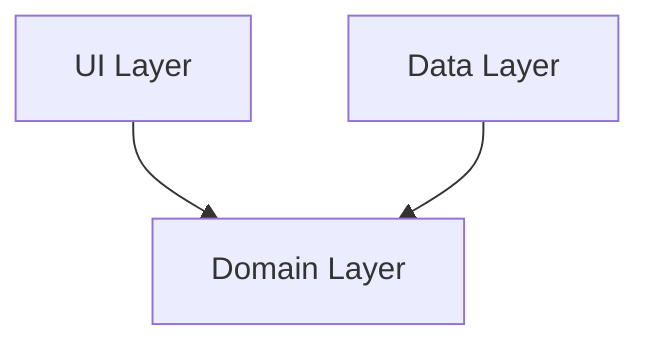

# Codebase Structure Map

## 📂 Directory Topology
[Display a tree view of the project structure]

## 🔗 Key Dependencies
- **[File A]** -> imports -> **[File B]**
- **[File C]** -> depends on -> **[Module D]**

## 🗺 Structural Diagram (Mermaid)

## ⚠️ Architectural Risks
- [Risk 1]: Circular dependency between X and Y.
- [Risk 2]: Z is becoming a "God Object".
